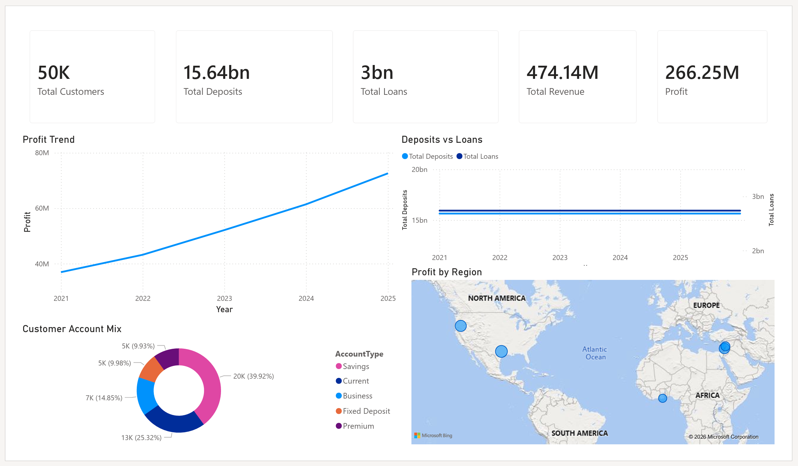
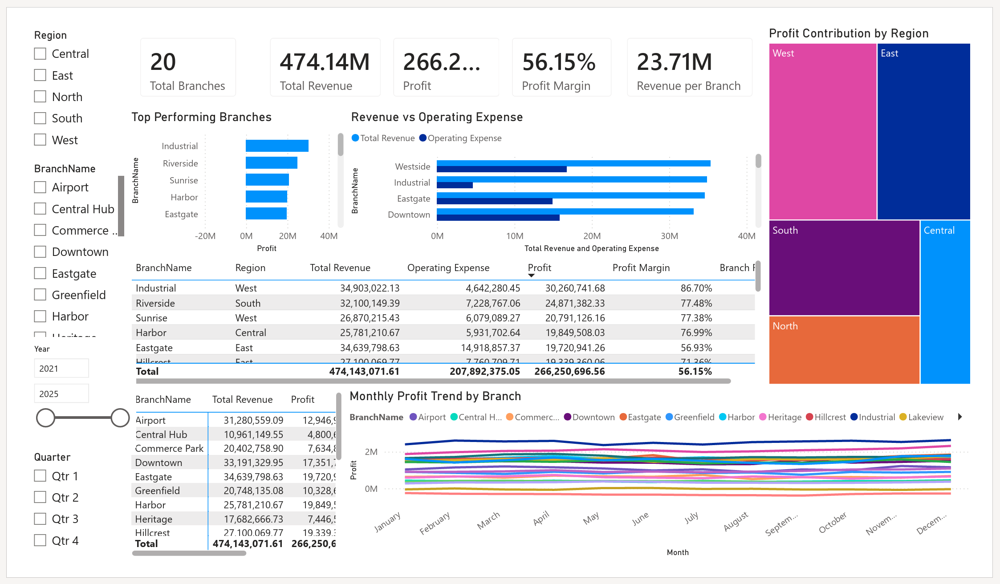
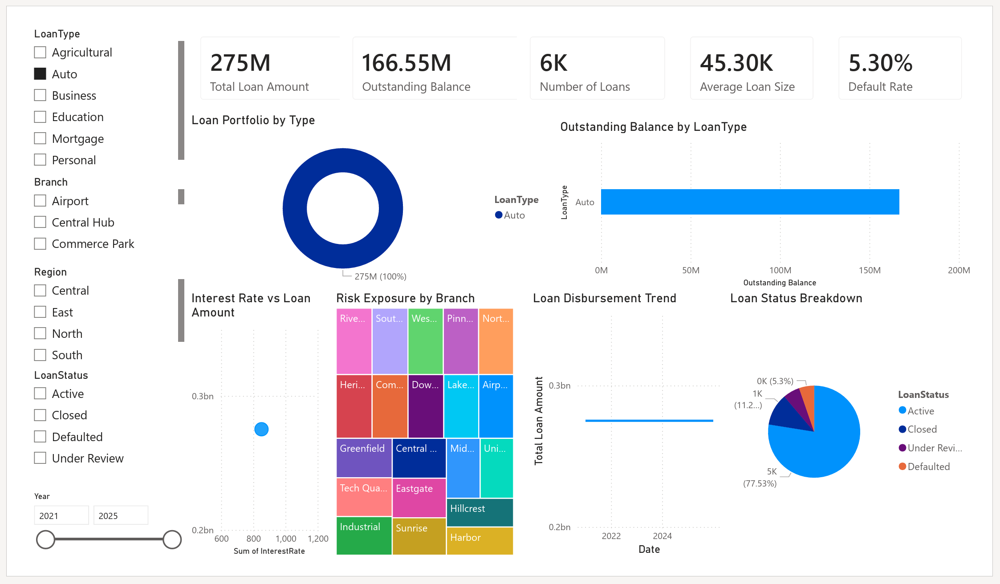
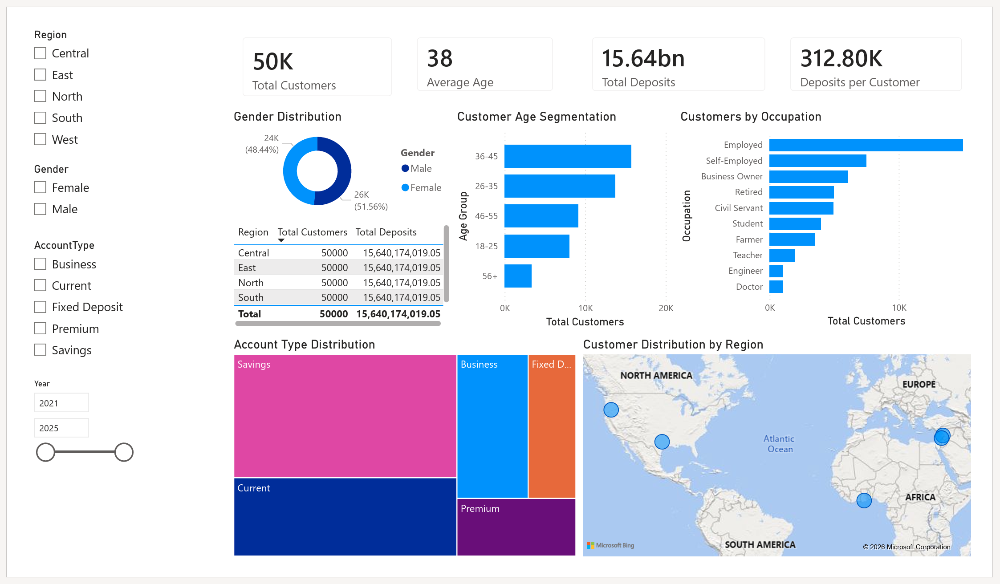
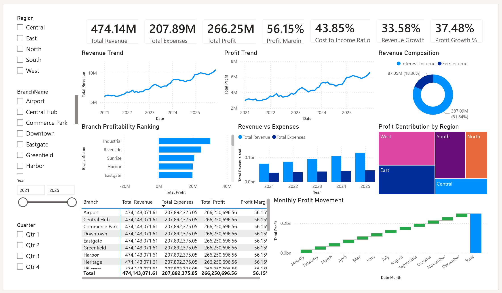

# Retail Banking Analytics Dashboard (Power BI)

## Project Overview

This project presents a comprehensive Retail Banking Analytics Dashboard developed using Microsoft Power BI. The dashboard provides insights into customer behavior, branch performance, loan portfolio management, credit risk exposure, deposit mobilization, and overall financial performance.

The objective is to support data-driven decision-making for banking executives, branch managers, risk analysts, and business intelligence teams.

---

## Business Problem

Banks generate large volumes of customer, deposit, loan, and financial data. Without effective reporting tools, it becomes difficult to monitor performance, identify risks, and make strategic decisions.

This dashboard addresses these challenges by providing an integrated analytical solution.

---

## Tools Used

* Microsoft Power BI
* DAX
* Power Query
* Excel
* Data Modeling

---

## Dashboard Pages

### 1. Executive Overview

* Total Customers
* Total Deposits
* Total Loans
* Revenue Analysis
* Profitability Overview

### 2. Branch Performance Dashboard

* Branch Rankings
* Revenue vs Expense Analysis
* Regional Performance
* Branch Scorecards

### 3. Loan Portfolio & Credit Risk Dashboard

* Loan Portfolio Composition
* Outstanding Balances
* Loan Status Analysis
* Default Rate Monitoring
* Risk Exposure Analysis

### 4. Customer Analytics Dashboard

* Customer Segmentation
* Demographic Analysis
* Account Type Distribution
* Regional Customer Analysis
* Deposit Contribution Analysis

### 5. Financial Performance Dashboard

* Revenue Trends
* Profit Trends
* Cost-to-Income Ratio
* Profit Margin Analysis
* Branch Profitability

---

## Key Skills Demonstrated

* Business Intelligence
* Banking Analytics
* Financial Analysis
* Data Modeling
* Dashboard Design
* KPI Development
* DAX Calculations
* Data Visualization

---

## Project Screenshots

## Executive Overview

## Branch Performance

## Loan Portfolio & Credit Risk

## Customer Analytics

## Financial Performance

---

## Author

Frederick Kwame Molah

Aspiring Business Intelligence & Banking Data Analyst
